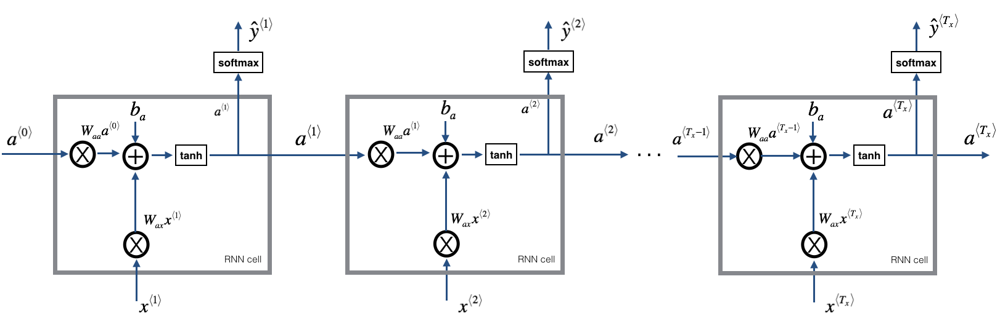

# Building a Recurrent Neural Network - Step by Step - v3
Recurrent Neural Networks (RNN) are very effective for Natural Language Processing and other sequence tasks because they have "memory". They can read inputs
 (such as words) one at a time, and remember some information/context through the hidden layer activations that get passed from one time-step to the next. This allows a uni-directional RNN to take information from the past to process later inputs. A bidirection RNN can take context from both the past and the future.

## RNN cell
A Recurrent neural network can be seen as the repetition of a single cell. You are first going to implement the computations for a single time-step. The following figure describes the operations for a single time-step of an RNN cell.

## RNN forward pass
You can see an RNN as the repetition of the cell you've just built. If your input sequence of data is carried over 10 time steps, then you will copy the RNN cell 10 times. Each cell takes as input the hidden state from the previous cell 
and the current time-step's input data . It outputs a hidden state 
and a prediction  for this time-step.

## Long Short-Term Memory (LSTM) network
This following figure shows the operations of an LSTM-cell.

## Forward pass for LSTM

