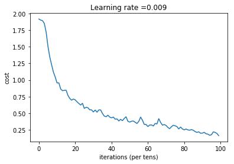

# Convolution model Application - v1

Let's implement a fully functioning Convolution Net using TensorFlow. We build and train a 
ConvNet in TensorFlow for a classification problem.

## Output
Last line of application.py runs the code to train the model for 100 epochs.

Tensor("Mean_1:0", shape=(), dtype=float32)

Train Accuracy: 0.940741

Test Accuracy: 0.783333

