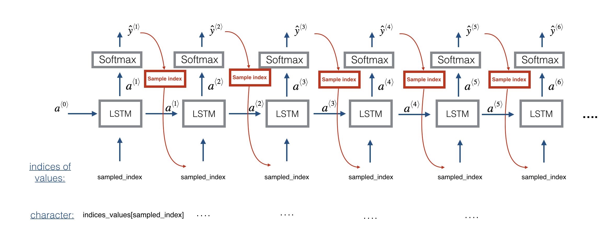

# Improvise a Jazz Solo with an LSTM Network
Here we will implement a model that uses an LSTM to generate music.

We will learn to:

    - Apply an LSTM to music generation.
    - Generate our own jazz music with deep learning.
    
## Problem statement
You would like to create a jazz music piece specially for a friend's birthday. However, you don't know any instruments or music composition. Fortunately, you know deep learning and will solve this problem using an LSTM netwok.
You will train a network to generate novel jazz solos in a style representative of a body of performed work.

You will train your algorithm on a corpus of Jazz music.
We have taken care of the preprocessing of the musical data to render it in terms of musical "values." You can informally think of each "value" as a note, which comprises a pitch and a duration. For example, if you press down a specific piano key for 0.5 seconds, then you have just played a note. In music theory, a "value" is actually more complicated than this--specifically, it also captures the information needed to play multiple notes at the same time. For example, when playing a music piece, you might press down two piano keys at the same time (playng multiple notes at the same time generates what's called a "chord"). But we don't need to worry about the details of music theory for this assignment. For the purpose of this assignment, all you need to know is that we will obtain a dataset of values, and will learn an RNN model to generate sequences of values.
Our music generation system will use 78 unique values.
## Overview of our model
Here is the architecture of the model we will use.

We will be training the model on random snippets of 30 values taken from a much longer piece of music.
## Generating music
We have a trained model which has learned the patterns of the jazz soloist. Lets now use this model to synthesize new music.

At each step of sampling, you will take as input the activation a and cell state c from the previous state of the LSTM, forward propagate by one step, and get a new output activation as well as cell state. The new activation a can then be used to generate the output, using densor as before.
