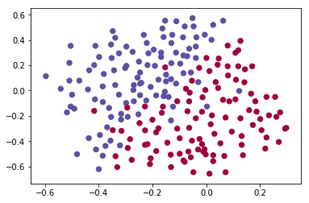
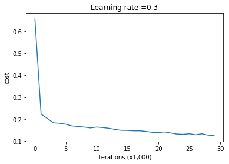
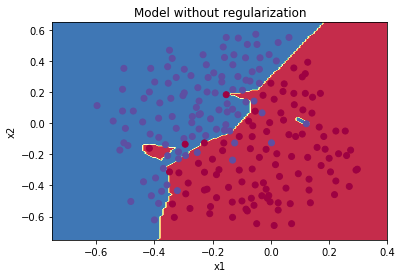
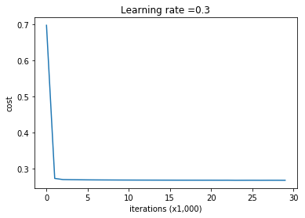
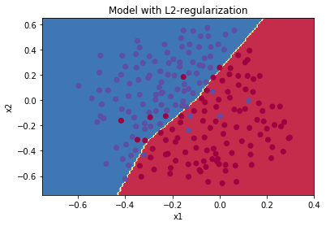
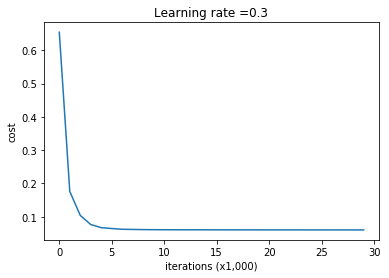
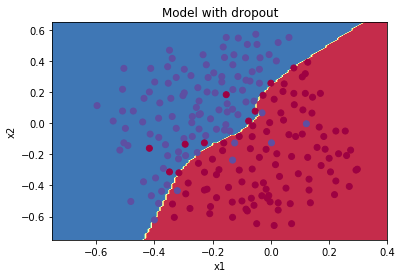

# Regularization
Deep Learning models have so much flexibility and capacity that overfitting can be a serious problem, if the training dataset is not big enough. Sure it does well on the training set, but the learned network doesn't generalize to new examples that it has never seen!

Problem Statement: You have just been hired as an AI expert by the French Football Corporation. They would like you to recommend positions where France's goal keeper should kick the ball so that the French team's players can then hit it with their head.

They give you the following 2D dataset from France's past 10 games.
```
train_X, train_Y, test_X, test_Y = load_2D_dataset()
```

Each dot corresponds to a position on the football field where a football player has hit the ball with his/her head after the French goal keeper has shot the ball from the left side of the football field.
	- If the dot is blue, it means the French player managed to hit the ball with his/her head
	- If the dot is red, it means the other team's player hit the ball with their head
Your goal: Use a deep learning model to find the positions on the field where the goalkeeper should kick the ball.

## 1 - Non-regularized model
The common function here is model(...) that we want to use with and without regularization.
Let's train the model without any regularization, and observe the accuracy on the train/test sets.
Uncomment the code below in Regularization.py file:
```
parameters = model(train_X, train_Y)
print ("On the training set:")
predictions_train = predict(train_X, train_Y, parameters)
print ("On the test set:")
predictions_test = predict(test_X, test_Y, parameters)
```
The output is:

Cost after iteration 0: 0.6557412523481002

Cost after iteration 10000: 0.16329987525724213

Cost after iteration 20000: 0.1385164242326018

On the training set:

Accuracy: 0.9478672985781991

On the test set:

Accuracy: 0.915

The train accuracy is 94.8% while the test accuracy is 91.5%. This is the baseline model (we will observe the impact of regularization on this model). Uncomment the following code to plot the decision boundary of the model.
```
plt.title("Model without regularization")
axes = plt.gca()
axes.set_xlim([-0.75,0.40])
axes.set_ylim([-0.75,0.65])
plot_decision_boundary(lambda x: predict_dec(parameters, x.T), train_X, train_Y)
```

The non-regularized model is obviously overfitting the training set. It is fitting the noisy points!

## 2 - L2 Regularization
Let's now run the model with L2 regularization $(\lambda = 0.7)$. The model() function will call:
	- compute_cost_with_regularization instead of compute_cost
	- backward_propagation_with_regularization instead of backward_propagation

Uncomment the code below in Regularization.py:
```
parameters = model(train_X, train_Y, lambd = 0.7)
print ("On the train set:")
predictions_train = predict(train_X, train_Y, parameters)
print ("On the test set:")
predictions_test = predict(test_X, test_Y, parameters)
```
And the output is:

Cost after iteration 0: 0.6974484493131264

Cost after iteration 10000: 0.2684918873282239

Cost after iteration 20000: 0.26809163371273004

On the train set:

Accuracy: 0.9383886255924171

On the test set:

Accuracy: 0.93

Congrats, the test set accuracy increased to 93%. We have saved the French football team!

We are not overfitting the training data anymore. Let's plot the decision boundary with uncommecnting the code below.
```
plt.title("Model with L2-regularization")
axes = plt.gca()
axes.set_xlim([-0.75,0.40])
axes.set_ylim([-0.75,0.65])
plot_decision_boundary(lambda x: predict_dec(parameters, x.T), train_X, train_Y)
```


## 3 - Dropout
Finally, dropout is a widely used regularization technique that is specific to deep learning. It randomly shuts down some neurons in each iteration.
Let's now run the model with dropout (keep_prob = 0.86). It means at every iteration you shut down each neurons of layer 1 and 2 with 24% probability. The function model() will now call:
	- forward_propagation_with_dropout instead of forward_propagation.
	- backward_propagation_with_dropout instead of backward_propagation.
```
parameters = model(train_X, train_Y, keep_prob = 0.86, learning_rate = 0.3)

print ("On the train set:")
predictions_train = predict(train_X, train_Y, parameters)
print ("On the test set:")
predictions_test = predict(test_X, test_Y, parameters)
```
The output is:
Cost after iteration 0: 0.6543912405149825

Cost after iteration 10000: 0.061016986574905605

Cost after iteration 20000: 0.060582435798513114

On the train set:

Accuracy: 0.9289099526066351

On the test set:

Accuracy: 0.95

Dropout works great! The test accuracy has increased again (to 95%)! Your model is not overfitting the training set and does a great job on the test set.

And uncomment the code below to plot the decision boundary.
```
plt.title("Model with dropout")
axes = plt.gca()
axes.set_xlim([-0.75,0.40])
axes.set_ylim([-0.75,0.65])
plot_decision_boundary(lambda x: predict_dec(parameters, x.T), train_X, train_Y)
```



